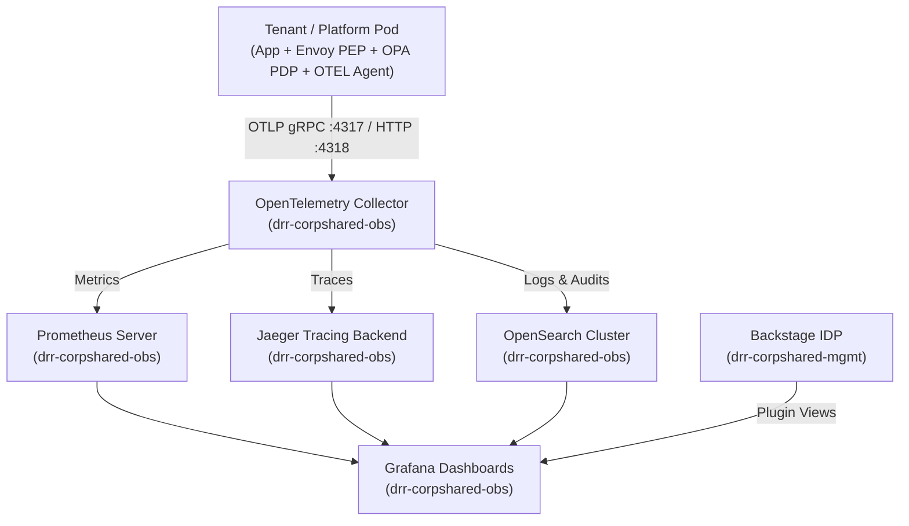

# Master Platform Specification (01-initial-spec.md)
# Project: darueira-privatecloud-platform

## 1. Executive Summary & Vision
`darueira-privatecloud-platform` is an on-premise Private Cloud and Internal Developer Platform (IDP) designed to deliver self-service, secure, and standardized environment provisioning across multiple Tenants and Projects.

### 1.1 Overview & Architecture Goals
The **Darueira Private Cloud Platform** is an enterprise-grade local/private Kubernetes infrastructure designed for high-performance backend workloads, multi-tenancy, zero-trust security, and observable microservice ecosystems.

Inspired by enterprise platform architectures (such as Tesla Cloud Platform - TCP and EDP/50-Hertz/MCCS), it integrates native Zero Trust security, declarative Kubernetes orchestration, polyglot microservices, dynamic secrets management, unified CI/CD with Tekton + ArgoCD, dedicated control plane persistence, and hybrid authorization (OIDC + ReBAC).

---

## 2. Infrastructure & Runtime Baseline
- **Target Host**: Linux Mint 22.3 (64 GB RAM, Intel Core i9, 20 vCPUs). (Personal Laptop)
  - **Compute Resources:** 20 vCPUs, 64 GB RAM, Multi-core optimization
* **Runtime / Orchestration:**
  - **Kubernetes Engine**: **Canonical MicroK8s** (snap-based local system daemon).
  - **Container Runtime**: `containerd` / Docker
  - **Storage**: MinIO (S3-compatible Object Storage), Local Persistent Volumes
- **CNI & Mesh**: **Cilium CNI** (eBPF routing, L3-L7 NetworkPolicies, WireGuard node-to-node encryption, kube-proxy replacement). *Target state; the running cluster still uses MicroK8s' default Calico CNI (see Section 11).*
- **LoadBalancer / Ingress**: Apache APISIX Gateway exposed via NodePort (`30080` HTTP / `30443` HTTPS) and reached through `make proxy` / `make proxy-80`. MicroK8s MetalLB is the target LoadBalancer and is not enabled yet (see Section 11).
- **Future Hybrid Target**: Remote VPS (Hostinger) for staging/production external simulation.

---
## 3. High-Level Architecture & Component Topology

                  +----------------------------------------------+
                  |            API Gateway (Apache APISIX)       |
                  |     (mTLS + OIDC Authentik / Token Validate) |
                  +-----------------------+----------------------+
                                          |
         +--------------------------------+--------------------------------+
         |                                |                                |
         v                                v                                v
+-------------------+           +-------------------+            +-------------------+
|  Tenant & Project |           | Environment       |            | Identity & Authz  |
|  Manager Service  |           | Engine Service    |            | Service (OpenFGA) |
|   (Golang/Java)   |           |  (Golang/K8s SDK) |            |    (Go/Kotlin)    |
+---------+---------+           +---------+---------+            +---------+---------+
          |                               |                                |
          +-------------------------------+--------------------------------+
          |
          v
+-----------------------+
|   darueira-operator   |
|   (K8s CRDs Controller|
|   + Tekton / GitOps)  |
+-----------------------+


### Core Control Plane Services
1. **`drr-iam-authz-svc`** (Go / Kotlin): Authorization gateway verifying OIDC claims against Keycloak/Authentik and evaluating ReBAC tuples in OpenFGA.
2. **`drr-tenant-svc`** (Java 25 / Spring Boot 4.1.0 / Kotlin or Go): Lifecycle management for Tenants/Organizations, Projects, and resource quotas.
3. **`drr-env-orchestrator-svc`** (Go): Translates environment specifications into Custom Resources (CRDs) and triggers Tekton Pipelines and ArgoCD ApplicationSets.
4. **`drr-operator`** (Go / Kubebuilder): Kubernetes Operator reconciling Tenant Namespaces, Cilium Network Policies, Vault bindings, and SPIRE registrations.
5. **`drr-ctlr-cli`** (Go / Cobra): Developer and platform administrator CLI tool.

### 3.1 Core Platform Components

#### 3.1.1. Identity, Access & Secrets Management (IAM / Security)
* **Authentication & Identity Provider:** Keycloak / Authentik (OIDC, OAuth2, SAML)
* **Fine-Grained Authorization (ReBAC / RBAC):** OpenFGA (Relationship-Based Access Control)
* **Secrets Management:** OpenBao / HashiCorp Vault (PKI, dynamic secrets, transit encryption)

#### 3.1.2. Data & Messaging Services
* **Databases:** PostgreSQL 17 (Relational), MongoDB 7 (Document), MySQL (per-tenant, used by tenant workloads)
* **Object Storage:** MinIO (Central and per-Tenant)
* **Event Streaming & Async Messaging:**
    * Kafka API via Redpanda `v24.1.8` with Kafbat UI (ADR-0008)
    * RabbitMQ 4 (AMQP message broker)

#### 3.1.3. Observability & Operations
* **Metrics & Dashboards:** Prometheus + Grafana
* **Distributed Tracing:** OpenTelemetry Collector + Jaeger
* **Logs:** Fluent Bit (DaemonSet) + OpenSearch + OpenSearch Dashboards
* **GitOps & Delivery:** Forgejo (Git) + Tekton (Pipelines, Triggers, Dashboard) + ArgoCD
* **Developer Portal:** Backstage

#### 3.1.4. Business Integration & Workflow Services (`drr-corpshared-plat`)
* **Workflow Orchestration:** Temporal (server + Web UI, Keycloak OIDC, multi-tenant namespaces).
* **Data Flow / ETL:** Apache NiFi (Keycloak OIDC, persistent authorizations, flows and repositories).
* **Reporting:** jsreport (PostgreSQL store, Chrome PDF engine, S3 storage in Central MinIO, Keycloak OIDC).
* **Digital Identity (eIDAS 2.0 / EUDI Wallet):** Clavex (server, UI and Redis).
* **Webmail:** Roundcube in front of Stalwart Mail Server.
* **Certificates:** cert-manager (`drr-corpshared-secr-internal`).

---

## 4. Trust Domains & Services Topology

Following the MCCS / EDP / 50Hz trust domain separation model, the platform segregates central shared services from isolated tenant workloads.

+-----------------------------------------------------------------------------------+
|                     ENTERPRISE SHARED SERVICES (CONTROL PLANE)                    |
|   Namespaces: drr-corpshared-mgmt | drr-corpshared-plat | drr-corpshared-secr-internal |
|               drr-corpshared-obs                                                  |
+-----------------------------------------------------------------------------------+
|  * Master Identity Provider: Authentik (Enterprise AD / EntraID Mock, LDAP outpost)|
|  * Central Platform IAM: Keycloak (federated with Authentik)                      |
|  * Master PKI & Root Vault: OpenBao Master + cert-manager + SPIRE Server          |
|  * Universal Artifact & Image Registry: Sonatype Nexus OSS (Docker, Helm, Maven)  |
|  * Git Server: Forgejo (HTTP + SSH :2222, Tekton webhooks)                        |
|  * Corporate Mail Server: Stalwart Mail Server + Roundcube Webmail                |
|  * Developer Portal (IDP): Spotify Backstage (Catalog, TechDocs, Golden Paths)   |
|  * Edge API Gateway: Apache APISIX Gateway + Dashboard (etcd-backed)              |
|  * Authorization: OpenFGA + drr-iam-authz-svc                                     |
|  * Platform Services: drr-tenant-svc, drr-env-orchestrator-svc, darueira-operator |
|  * Business Integration: Temporal, Apache NiFi, jsreport, Clavex (eIDAS/EUDI)     |
|  * Messaging: Redpanda (Kafka API) + Kafbat UI, RabbitMQ                          |
|  * Control Plane Storage & Persistence (Dedicated):                               |
|      - Central MinIO: S3 Blobs for Nexus, Backstage TechDocs, Stalwart, jsreport  |
|      - Central PostgreSQL: Dedicated DBs for Authentik, Keycloak, OpenFGA, Git,   |
|        Backstage, Mail, Temporal, jsreport                                        |
|  * Declarative CI/CD Pipelines: Tekton Pipelines & Triggers                       |
|  * GitOps Continuous Delivery: ArgoCD                                             |
|  * Central Observability (drr-corpshared-obs): OpenTelemetry Collector, Jaeger,   |
|    Prometheus, Grafana, Fluent Bit, OpenSearch (+ Dashboards)                     |
+-----------------------------------------------------------------------------------+
|
| SPIFFE mTLS / OpenFGA ReBAC / APISIX
v
+-----------------------------------------------------------------------------------+
|                             TENANT ENVIRONMENT PLANE                              |
|               Namespaces: drr-tnt-{tenant-id}-{env} (Dev, Staging, Prod)          |
+-----------------------------------------------------------------------------------+
|  * Tenant Ingress & Edge: Apache APISIX DataPlane                                 |
|  * Dedicated Tenant IAM: Keycloak (Instance per Tenant/Env: drr_tnt_keycloak_db)  |
|  * Dedicated Secrets: OpenBao Tenant (Per-Env instance & SPIFFE X.509 SVID)       |
|  * Dedicated Tenant S3 Storage: MinIO (Dedicated per Tenant/Env)                  |
|  * Dedicated Data Stores: PostgreSQL (drr_tnt_bizapps_db with schm01..N), Mongo,  |
|    MySQL (see Section 11: MySQL is deployed but not yet in tnt-tenant-base)       |
|  * Message Brokers: RabbitMQ (Topic / VHost isolation) & Kafka API (Redpanda)     |
|  * Workload Identity: SPIRE Agent (Injecting SVIDs into application pods)         |
+-----------------------------------------------------------------------------------+

### 4.0 Tenant Infrastructure & Storage Isolation Rules (ADR-0013)
1. **Namespace Standard**: `drr-tnt-<Tenant Name>-<Environment>` (e.g. `drr-tnt-swfabrik-europe-dev`). Section 7 and legacy namespaces (`drr-tnt-acme-storefront-dev`, `drr-tnt-swfabrik-europe-marketplaces-dev`) still use the older `drr-tnt-<tenant>-<project>-<env>` form; ADR-0013 is authoritative; the legacy namespaces still exist in the cluster and have not been migrated.
2. **Project Environment Sharing**: A Tenant has default `dev` (and on-demand `stg`, `prd`). All Projects under a Tenant share the same Environments of that Tenant. Never create an Environment per Project.
3. **Dedicated Baseline Services per Environment**: Each `drr-tnt-<tenant>-<env>` hosts its own `tenant-openbao`, `tenant-minio`, `tenant-postgres`, `tenant-mongodb`, and `tenant-keycloak`.
4. **Storage Isolation**: Tenant workloads NEVER persist data in `drr-corpshared-*` services. All persistence targets the tenant's dedicated services.
5. **Database & Schema Convention**: Every `tenant-postgres` contains `drr_tnt_keycloak_db` and `drr_tnt_bizapps_db`. Each project uses a sequential schema `schm01`, `schm02`, etc., in `drr_tnt_bizapps_db`.

### 4.1 Development & Workflow Conventions

* **Methodology:** Spec-Driven Development (SDD)
* **Tooling Integration:** Local AI agents & IDE specifications (`.antigravity` / prompt specs)
* **Validation Criteria:**
    * All deployments managed via Declarative GitOps manifests / Helm charts.
    * Secrets must never be stored in plain text; dynamic injection via Secret Operator / Vault / OpenBao.
    * Relationship-based access queries verified against OpenFGA models prior to service access.

---

## 5. Comprehensive Services Matrix

| Domain | Technology | Delivery Scope | Authentication / Governance |
| :--- | :--- | :--- | :--- |
| **Developer Portal** | Spotify Backstage | Enterprise Shared | OIDC (Authentik) + OpenFGA RBAC Plugin |
| **Universal Registry** | Sonatype Nexus OSS | Enterprise Shared | Authentik LDAP Outpost (Docker, Helm, Maven, NPM, PyPI) |
| **Git Repository Server** | Forgejo Git | Enterprise Shared | Native Git HTTP / SSH (:2222) + Webhooks + GitHub REST API |
| **Corporate Mail** | Stalwart Mail Server | Enterprise Shared | Authentik LDAP Outpost / Directory Sync (SMTP, IMAP, JMAP) |
| **Control Plane Storage** | Central MinIO | Enterprise Shared | Internal S3 credentials for Nexus, TechDocs, Stalwart Blobs |
| **Control Plane DB** | Central PostgreSQL 17 | Enterprise Shared | Dedicated databases (`drr_authentik_db`, `drr_keycloak_db`, `drr_git_db`, `drr_stalwart_mailserver_db`, `openfga`, `backstage`) |
| **CI Engine** | Tekton Pipelines | Enterprise Shared | K8s RBAC + Workload Identity |
| **CD / GitOps** | ArgoCD | Enterprise Shared | Authentik OIDC SSO |
| **Master PKI / Vault** | OpenBao Master | `secr-internal` | Root/Intermediate CA & SPIRE Master Keys |
| **Dynamic Secrets** | OpenBao Tenant Engine | Tenant Environment | SPIFFE Auth Method (Zero Static Tokens) |
| **Edge API Gateway** | Apache APISIX | Tenant Environment | mTLS termination + OpenFGA Plugin |
| **Central Platform IAM** | Keycloak Platform | Enterprise Shared | Federated with Authentik Master Directory (Upstream OIDC Brokering) |
| **Tenant Application IAM** | Keycloak Tenant Instance | Tenant Environment | Dedicated per-tenant Keycloak managing business application users |
| **Tenant Object Storage** | Tenant MinIO / Buckets | Tenant Environment | S3 API + Tenant IAM Policies |
| **Tenant Relational DB** | PostgreSQL 17 | Tenant Environment | Plain StatefulSet (`tenant-postgres`); CloudNative-PG Operator is the target and is not installed |
| **Tenant NoSQL DB** | MongoDB 7 | Tenant Environment | Plain StatefulSet (`tenant-mongodb`); MongoDB Community Operator is the target and is not installed |
| **Tenant MySQL** | MySQL | Tenant Environment | Plain StatefulSet (`tenant-mysql`), PVs declared in `storage-pvs.yaml` |
| **Streaming Broker** | Redpanda (Kafka API) + Kafbat UI | Enterprise Shared | ADR-0008; Strimzi Operator is not used |
| **Messaging Broker** | RabbitMQ 4 | Enterprise Shared | Management console behind APISIX |
| **APM & Tracing** | OpenTelemetry Collector + Jaeger | Enterprise Shared | OTel Collector with Tenant Tag Injection; SigNoz is not deployed |
| **Workflow Engine** | Temporal | Enterprise Shared | Keycloak OIDC on Web UI, multi-tenant namespaces |
| **Data Flow / ETL** | Apache NiFi | Enterprise Shared | Keycloak OIDC, APISIX routing |
| **Reporting** | jsreport | Enterprise Shared | Keycloak OIDC, PostgreSQL store, S3 storage in Central MinIO |
| **Digital Identity (eIDAS/EUDI)** | Clavex | Enterprise Shared | API and UI split by APISIX route priority |
| **Webmail** | Roundcube | Enterprise Shared | Fronts Stalwart Mail Server |
| **Certificates** | cert-manager | `secr-internal` | `ClusterIssuer` backed by OpenBao / internal Root CA |
| **Log Shipping** | Fluent Bit | Enterprise Shared | DaemonSet forwarding to OpenSearch |
| **Network & Security** | Cilium CNI + WireGuard| Platform-wide | Target: eBPF L3-L7 Policies & Transparent Encryption. Running CNI is Calico (Section 11) |

---

## 6. Fine-Grained Authorization Model (OpenFGA)

The platform applies Relationship-Based Access Control (ReBAC) structured across the hierarchy:
$$\text{Tenant} \longrightarrow \text{Project} \longrightarrow \text{Environment} \longrightarrow \text{Component}$$

### `authz/schema.fga` (DSL v1.2)

```dsl
model
  schema 1.1

type user

type tenant
  relations
    define admin: [user]
    define member: [user] or admin

type project
  relations
    define tenant: [tenant]
    define owner: [user] or admin from tenant
    define maintainer: [user] or owner
    define viewer: [user] or maintainer or member from tenant

    define can_create_environment: maintainer
    define can_delete: owner

type environment
  relations
    define project: [project]
    
    define operator: [user] or maintainer from project
    define deployer: [user] or operator
    define viewer: [user] or deployer or viewer from project

    define can_deploy: deployer
    define can_view_logs: viewer
    define can_manage_secrets: operator
    define can_destroy_env: owner from project

type component
  relations
    define environment: [environment]
    define maintainer: [user] or operator from environment
    define viewer: [user] or viewer from environment

    define can_read: viewer
    define can_write: maintainer
    define can_restart: maintainer

```

## 7. Multi-Tenancy & Zero Trust Workload Workflow

### Namespace Isolation Pattern: drr-tnt-{tenant_id}-{project_id}-{environment}.

### Workload Identity Lifecycle:

- The Pod starts in MicroK8s with a dedicated ServiceAccount.

- The SPIRE Agent daemonset attests the Pod using the Kubernetes Workload Attestor.

- SPIRE issues an X.509 SVID with URI: 

`spiffe://darueira.local/ns/{namespace}/sa/{serviceaccount}.`

### Dynamic Secret Retrieval:

- The application uses its SVID certificate to authenticate against OpenBao via the SPIFFE Auth Method.

- OpenBao verifies the SPIFFE ID, applies the matching tenant access policy, and issues short-lived database/broker credentials directly into memory (via CSI Driver).

### CI/CD Lifecycle:

- Developer triggers pipeline via Backstage / drr-ctlr-cli.

- Tekton PipelineRun builds, tests, runs security scans (Trivy), and pushes artifacts to Nexus OSS (with blobs persisted in Central MinIO).

- ArgoCD syncs the target environment manifest into the tenant namespace.

## 8. OPA Sidecar & Hybrid Policy Enforcement Engine

### 8.1. Architecture & PEP / PDP Separation
The platform enforces a strict separation between the **Policy Enforcement Point (PEP)** and the **Policy Decision Point (PDP)** within workload Pods:
- **PEP (Envoy Proxy)**: Intercepts all inbound HTTP/gRPC traffic at the Pod network boundary on listener port `8000`. It utilizes the standard `envoy.filters.http.ext_authz` extension to delegate authorization decisions to OPA before routing to the application container.
- **PDP (Open Policy Agent - OPA)**: Listens on local loopback gRPC (`127.0.0.1:9191`) and HTTP (`127.0.0.1:8181`). It evaluates contextual attributes, SPIFFE IDs, claims, and Rego policy rules, querying OpenFGA (`drr-iam-authz-svc`) when relationship graph checks are required.

### 8.2. Envoy Proxy `ext_authz` Filter Specification
- **Filter**: `envoy.filters.http.ext_authz` (Transport API v3).
- **Interception Flow**:
  $$\text{Ingress Traffic} \longrightarrow \text{Envoy PEP (:8000)} \xrightarrow[\text{timeout: 0.25s}]{\text{gRPC :9191}} \text{OPA PDP} \xrightarrow[\text{ReBAC}]{\text{Graph Check}} \text{OpenFGA} \longrightarrow \text{App (:8080)}$$
- **Timeout Limit**: Strict timeout threshold of `0.25s` (250ms) for gRPC check calls to prevent connection bottlenecks.
- **Fail-Closed Security**: `failure_mode_allow: false` is strictly enforced. If OPA is unreachable, booting, or times out, Envoy rejects the incoming request with HTTP `503 Service Unavailable`.
- **Payload Inspection**: Up to `8192` bytes (8 KB) of request body can be buffered and forwarded to OPA for attribute-based and body-content validation.

### 8.3. Authorization Enforcement Scope
The platform applies differentiated authorization enforcement across service types:

| Target Domain | Enforcement Architecture | Mechanism |
| :--- | :--- | :--- |
| **Custom Platform Services** (`drr-tenant-svc`, `drr-iam-authz-svc`, `drr-env-orchestrator-svc`) | **Full In-Pod Sidecar (PEP + PDP)** | Envoy `ext_authz` sidecar + OPA sidecar (`workload-sidecar-patch.yaml`) |
| **Tenant Workload Pods** (`drr-tnt-{tenant}-{project}-{env}`) | **Full In-Pod Sidecar (PEP + PDP)** | Envoy `ext_authz` sidecar + OPA sidecar (`workload-sidecar-patch.yaml`) |
| **COTS Enterprise Shared Services** (Nexus, Stalwart, MinIO, OpenBao, Authentik) | **Edge & Network Boundary Enforcement** | Apache APISIX Ingress Gateway + OpenFGA Plugin + Cilium L7 NetworkPolicies |

### 8.4. Rego Policy Distribution & Dynamic Updates
- **Bundle Storage**: Rego policies (`.rego`) and static data are stored in a dedicated bucket inside Central MinIO (`s3://drr-policy-bundles/`).
- **Distribution**: OPA sidecars pull bundles periodically or receive push notifications via webhook on policy update.
- **Policy Revocation**: Immediate bundle invalidation through ETag checks and cache eviction.

### 8.5. OpenFGA Tuple Synchronization & Revocation
- **Event-Driven Mutations**: Tenant/Project/Environment lifecycle events publish tuple mutation messages to Kafka topic `drr.authz.tuple-events`.
- **Reconciliation Engine**: `drr-iam-authz-svc` consumes events, writes/deletes tuples in OpenFGA PostgreSQL backend, and invalidates local evaluation caches.

---

## 9. Enterprise Observability Stack (`drr-corpshared-obs`)

The observability tier provides 360-degree Zero Trust observability across metrics, logs, distributed traces, and security audits:



### 9.1. Core Observability Components:
1. **OpenTelemetry Collector (`otel-collector`)**:
   - Central ingestion gateway for OpenTelemetry Protocol (OTLP).
   - Ingests OTLP traces (`grpc:4317`, `http:4318`), metrics, and structured logs.
   - Dispatches signals to Prometheus, Jaeger, and OpenSearch with batching and memory limiting.
2. **Prometheus Engine (`prometheus`)**:
   - Time-series metrics engine scraping Kubernetes nodes, control plane components, and tenant pods.
   - Alertmanager integration for infrastructure threshold breaches.
3. **Jaeger Tracing (`jaeger`)**:
   - Distributed tracing backend recording spans across Envoy PEP, OPA PDP, `drr-iam-authz-svc`, and backend business APIs.
4. **OpenSearch Cluster (`opensearch`)**:
   - Centralized distributed log search, indexing, and SIEM security analytics.
5. **Grafana Visualization (`grafana`)**:
   - Centralized visualization platform providing unified dashboards for infrastructure, security policies, and tenant applications.

### 9.2. In-Pod OTEL Auto-Instrumentation
All platform and tenant pods export telemetry via standard OTLP environment variables:
- `OTEL_EXPORTER_OTLP_ENDPOINT`: `http://otel-collector.drr-corpshared-obs.svc.cluster.local:4317`
- `OTEL_EXPORTER_OTLP_PROTOCOL`: `grpc`
- `OTEL_SERVICE_NAME`: `{service-name}`
- `OTEL_RESOURCE_ATTRIBUTES`: `k8s.namespace.name={namespace},k8s.pod.name={pod_name},darueira.io/tenant={tenant_id}`

---

## 10. Enterprise PKI, Identity & Messaging Infrastructure

### 10.1. Certificate Management & PKI (`cert-manager`)
- Namespace: `drr-corpshared-secr-internal`.
- Automates X.509 certificate issuance and rotation across Ingress routes and internal service endpoints.
- Provides `ClusterIssuer` definitions backed by OpenBao (Vault PKI engine) and internal Root CA.

### 10.2. Enterprise Identity Provider (Keycloak / Authentik)
- Namespace: `drr-corpshared-plat`.
- Centralized OIDC / OAuth2 authentication, SAML federation, and multi-tenant realm isolation.
- Backed by Central PostgreSQL 17 for realm configurations and user directories.

### 10.3. Cloud-Native Message Broker (Kafka / Redpanda)
- Namespace: `drr-corpshared-plat`.
- High-throughput, distributed event streaming platform for:
  - `drr.authz.tuple-events`: Event-driven ReBAC tuple mutations;
  - `drr.tenant.lifecycle-events`: Tenant, Project, and Environment provisioning events;
  - `drr.audit.security-events`: Zero Trust security and policy enforcement audit trails.

---

## 11. Implementation Status & Known Deviations (verified 2026-09-21)

Sections 1-10 describe the **target architecture**. This section records what is actually running on the single-node MicroK8s cluster (verified against `microk8s status`, live workloads and `platform/kustomize/base/`), so that the spec stays a trustworthy source of truth. Update it whenever a gap is closed or a new one is found.

### 11.1 Status Matrix

| Area | Status | Evidence / Notes |
| :--- | :--- | :--- |
| Control plane namespaces (`mgmt`, `plat`, `secr-internal`, `obs`) | **Live** | All workloads `Running`; node at ~61% memory with ~35 tenant and platform workloads |
| Identity: Authentik, Keycloak, OpenFGA, `drr-iam-authz-svc` | **Live** | ReBAC model tests: 4/4 suites, 136/136 checks (`make test-authz`); `authz/schema.fga` is identical to Section 6 |
| CI/CD and delivery: Forgejo, Tekton, ArgoCD, Nexus, Backstage | **Live** | Tenant apps are built by Tekton and pulled from Nexus (`127.0.0.1:32082`) |
| Shared services: Postgres, MinIO, Redpanda, RabbitMQ, Stalwart, Temporal, NiFi, jsreport, Clavex | **Live** | Manifests in `corpshared-plat/` |
| Observability: OTel Collector, Prometheus, Grafana, Jaeger, OpenSearch, Fluent Bit | **Live** | Manifests in `corpshared-obs/` |
| Platform CRDs (`tenants`, `projects`, `environments` in `darueira.io`) and `darueira-operator` | **Live** | One Tenant (`swfabrik-europe`), one Project (`marketplaces`), one Environment (`swfabrik-europe-dev`) |
| Tenant baseline (Keycloak, MinIO, OpenBao, Postgres, MongoDB) | **Live** | `swfabrik-europe-dev`, `swfabrik-latam-dev` |
| Tenant MySQL | **Partial** | `tenant-mysql` runs in both tenants and has PVs in `storage-pvs.yaml`, but no manifest exists in `tnt-tenant-base/` |
| Edge routing (APISIX) | **Live, NodePort** | `apisix-gateway` NodePorts `30080`/`30443`; routes generated by `scripts/bootstrap_apisix_routes.py` |
| MetalLB LoadBalancer | **Not enabled** | Addon is disabled; no `IPAddressPool` exists |
| Cilium CNI, L3-L7 policies, WireGuard | **Not running** | Cilium addon is disabled and no Cilium pods exist; the running CNI is Calico (`calico-node`). Cilium CRDs are installed and `network-policy.yaml` files declare `CiliumNetworkPolicy` objects, but without a Cilium agent they are **not enforced**. Namespace default-deny is therefore not active |
| SPIRE workload identity | **Placeholder** | Only `spire-server-placeholder` runs; there is no SPIRE Agent, so no SVIDs are issued (ADR-0012 is not yet realized) |
| OpenBao dynamic secrets via SPIFFE auth | **Partial** | `openbao-master` and per-tenant `tenant-openbao` run; SPIFFE auth depends on SPIRE above |
| Envoy PEP + OPA PDP sidecars (ADR-0003, Section 8) | **Partial** | Manifests and `workload-sidecar-patch.yaml` exist, but live pods do not run Envoy. Only `food-market-01-service` and `food-market-02-service` run an OPA container (`authzen-pdp-sidecar`, `openpolicyagent/opa:0.68.0`); platform services and the other tenant workloads have no sidecar |
| Kafka event topics (`drr.authz.tuple-events`, etc., Section 8.5) | **Not verified** | Broker is live; topic provisioning and the tuple-sync consumer were not checked |
| SigNoz, Strimzi, CloudNative-PG, MongoDB Community Operator | **Not used** | Replaced by Jaeger, Redpanda and plain StatefulSets (Section 5) |
| HA and remote staging target (Hostinger VPS) | **Not implemented** | Single node, `high-availability: no` |

### 11.2 Known Deviations To Resolve

1. **Network isolation is declared but not enforced.** Either enable Cilium (per ADR-0004) or replace the `CiliumNetworkPolicy` objects with standard `NetworkPolicy` objects that Calico enforces.
2. **Zero Trust identity is incomplete.** Deploy a real SPIRE Server and SPIRE Agent DaemonSet before relying on ADR-0012.
3. **Sidecar coverage is inconsistent.** Decide between the Envoy + OPA pattern of ADR-0003 and the OPA-only `authzen-pdp-sidecar` pattern seen in `food-market-01/02`, then record the decision in an ADR.
4. **`tenant-mysql` needs a manifest in `tnt-tenant-base/`** and a mention in ADR-0013, since it is not part of the documented tenant baseline.
5. **Namespace naming.** Legacy `drr-tnt-<tenant>-<project>-<env>` namespaces coexist with the ADR-0013 form.
6. **Plaintext development credentials** are listed in `README.md` for local convenience. They must not be reused outside this laptop lab.
